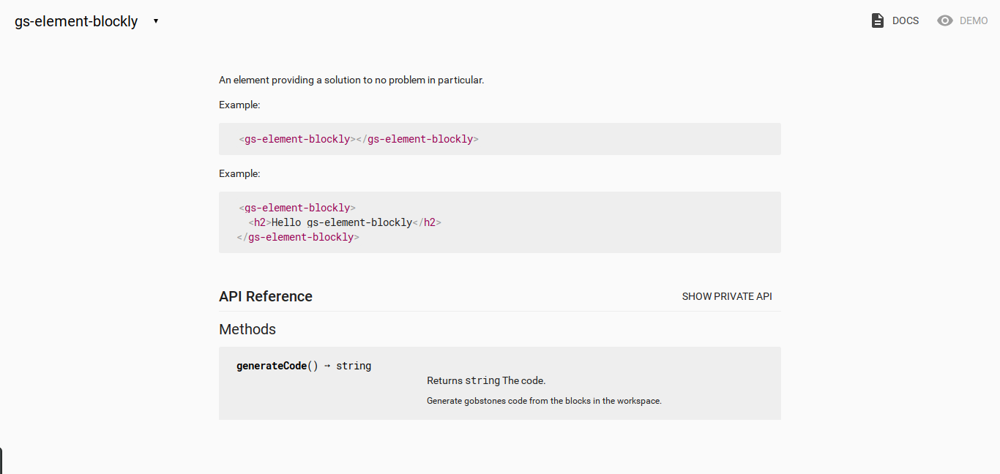
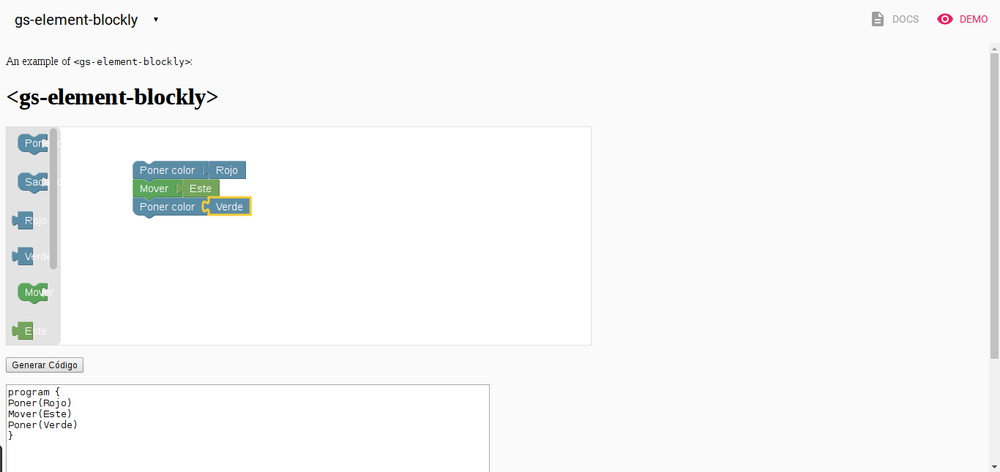

## Polymer blockly-element for Gobstones Web elements

## Getting Started

 - Clone the __dev__ branch on this repository.

### Install dependencies

#### Quick-start (for experienced users)

With Node.js installed, run the following one liner from the root of your Polymer Starter Kit download:

```sh
npm install -g gulp bower && npm install && bower install
```

#### Prerequisites (for everyone)

The full starter kit requires the following major dependencies:

- Node.js, used to run JavaScript tools from the command line.
- npm, the node package manager, installed with Node.js and used to install Node.js packages.
- gulp, a Node.js-based build tool.
- bower, a Node.js-based package manager used to install front-end packages (like Polymer).

**To install dependencies:**

1)  Check your Node.js version.

```sh
node --version
```

The version should be at or above 0.12.x.

2)  If you don't have Node.js installed, or you have a lower version, go to [nodejs.org](https://nodejs.org) and click on the big green Install button.

3)  Install `gulp` and `bower` globally.

```sh
npm install -g gulp bower
```

This lets you run `gulp` and `bower` from the command line.

4)  Install the starter kit's local `npm` and `bower` dependencies.

```sh
cd gs-element-starter && npm install && bower install
```

This installs the element sets (Paper, Iron, Platinum) and tools the starter kit requires to build and serve apps.

### Development workflow

#### Serve / watch

```sh
gulp serve
```

This outputs an IP address you can use to locally test and another that can be used on devices connected to your network.

#### Demo

Despues de correr gulp serve visitar http://localhost:5000/#gs-element-blockly



Y hacer click en el botón de arriba a la derecha "demo"


